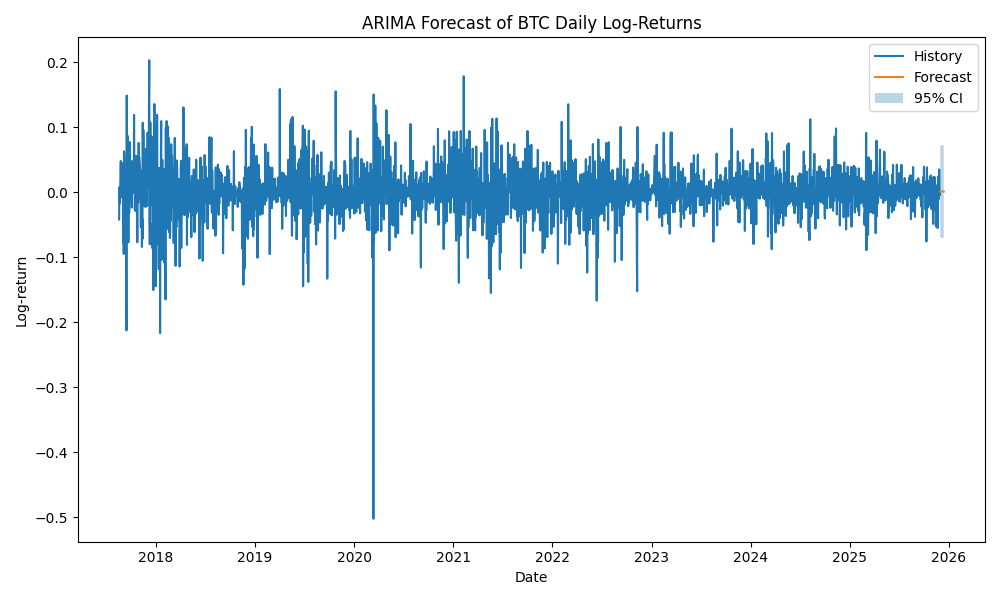

# Порівняння ARIMA та AR(1)-регресії для доходностей BTC/USDT

## 1. Порівняння інформаційних критеріїв

| Модель | AIC |
|--------|---------|
| ARIMA(0,0,2) | **−11484.69** |
| AR(1) OLS | ≈ **−11478.00** (за даними summary) |

ARIMA має нижчий AIC → модель **краще описує дані**.

---

## 2. Залежності та структура

### ARIMA:
- вловлює шумові залежності через MA(1), MA(2)
- підтверджує наявність короткострокової структури у доходностях
- залишки ≈ «білий шум»

### AR(1):
- дуже слабка автокореляція (b = –0.05)
- R² = 0.003 →
  модель майже нічого не пояснює  
- залишки також близькі до білого шуму

---

## 3. Прогнозування

### ARIMA:

- прогноз стабільний,
- 95% CI адекватний,
- короткостроковий прогноз <точніший>.

### AR(1):

- передбачення практично плоске,
- модель не реагує на волатильність,
- не може відтворити реальний шум.

---

## 4. Висновки порівняння

1. **ARIMA суттєво перевершує AR(1)** у якості підгонки та прогнозі.  
2. AR(1) показує, що BTC не має сильної лінійної автокореляції →  
   але ARIMA використовує нелінійні зв’язки через MA-компоненти.  
3. ARIMA адекватно враховує часову структуру, тоді як AR(1) фактично її ігнорує.  
4. Обидві моделі підтверджують:  
   **щоденні доходності BTC є майже непередбачуваними та дуже волатильними.**

---

## 5. Загальний висновок

Для моделювання доходностей BTC/USDT **краще використовувати ARIMA**,  
оскільки вона краще описує внутрішню структуру шуму та дає коректніший краткостроковий прогноз.

AR(1) може застосовуватися лише як базова, референсна модель,
але не підходить для реального прогнозування криптовалют.

