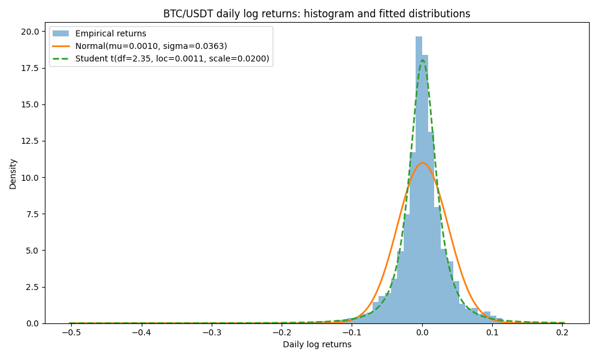
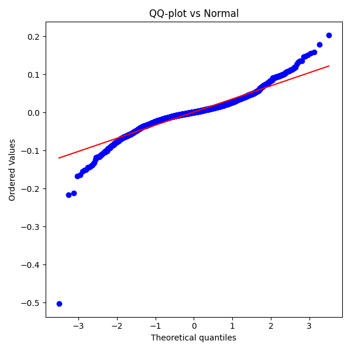
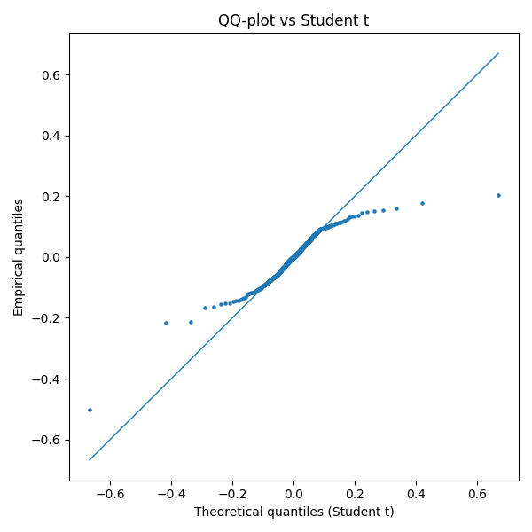

# Аналіз розподілу щоденних логарифмічних доходностей BTC/USDT

## 1. Гістограма та підгонка розподілів

На емпіричну гістограму щоденних логарифмічних доходностей BTC/USDT 
було накладено дві теоретичні щільності:

- нормальний розподіл з параметрами  
  **mu = 0.0010, sigma = 0.0363**;
- розподіл Стьюдента з параметрами  
  **df = 2.35, loc = 0.0011, scale = 0.0200**.

Візуально видно, що нормальний розподіл:

- недооцінює висоту піку біля нуля;
- суттєво недооцінює масу в хвостах (малі ймовірності великих коливань).

Розподіл Стьюдента краще узгоджується з гістограмою як у центрі, 
так і в хвостах.

## 2. Порівняння ймовірностей великих відхилень

Розглядалася подія **|R| > 0.10** (денна зміна більше 10% за модулем).

- Емпірична ймовірність: **P_emp = 0.0228**
- Нормальна модель: **P_norm = 0.0059**
- Модель Стьюдента: **P_t = 0.0267**

Нормальний розподіл майже в чотири рази недооцінює ймовірність 
великих рухів. Розподіл Стьюдента дає значення, близьке до емпіричного, 
що підтверджує наявність «товстих хвостів» у розподілі доходностей.

## 3. QQ-діагностика

### QQ-графік для нормального розподілу

На QQ-графіку для нормального розподілу точки суттєво відхиляються 
від прямої в обох хвостах, що вказує на невідповідність нормальної моделі 
реальним даним.

### QQ-графік для розподілу Стьюдента

QQ-графік щодо розподілу Стьюдента показує значно кращу лінійність 
у всьому діапазоні, включно з хвостами, що свідчить про кращу відповідність 
цього закону розподілу емпіричним даним.

## 4. Висновок

1. Розподіл щоденних доходностей BTC/USDT не є нормальним: хвости 
   суттєво «товстіші», ніж передбачає нормальний закон.
2. Розподіл Стьюдента з малим числом ступенів вільності (df ≈ 2.35) 
   краще описує емпіричні дані, особливо в зоні екстремальних значень.
3. Для моделювання ризику та великих цінових коливань BTC доцільно 
   використовувати саме t-розподіл, а не нормальний розподіл.
