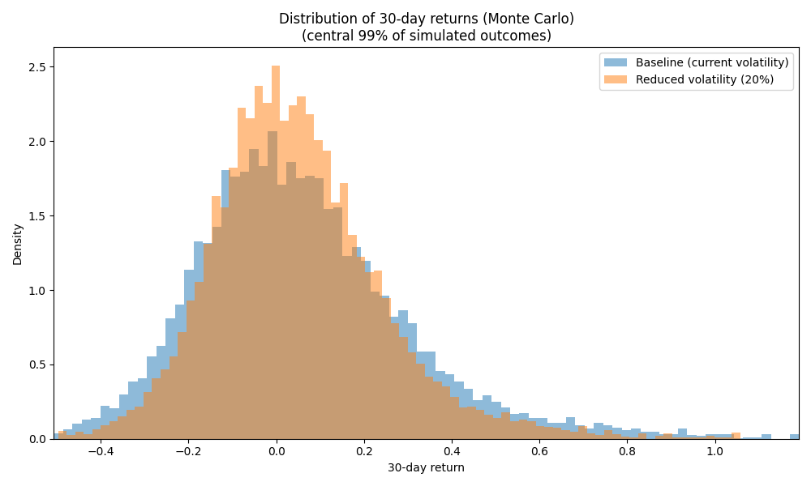

# Монте-Карло симуляція 30-денних доходностей BTC/USDT

## 1. Постановка задачі

На основі попереднього аналізу було встановлено, що щоденні логарифмічні
доходності BTC/USDT добре описуються розподілом Стьюдента з параметрами,
оціненими за історичними даними 2017–2025 рр.

У цьому розділі за допомогою методу Монте-Карло моделюється розподіл
30-денних доходностей BTC для двох сценаріїв:

1. **Базовий сценарій** – поточний рівень волатильності (параметри t-розподілу
   взяті без змін).
2. **Сценарій зі зниженням волатильності на 20%** – масштабний параметр
   t-розподілу (scale) зменшено на 20%, що імітує застосування заходів
   з управління ризиками.

Для кожного сценарію згенеровано по **10 000** траєкторій 30-денних цін
BTC. Стартова ціна – останнє спостереження з історичного ряду  
(**S0 ≈ 90 844.68 USDT**).

---

## 2. Результати симуляції

### 2.1. Базовий сценарій (current volatility)

- Ймовірність великого падіння:
  - **P(R30 < −30%) ≈ 0.0451 (4.51%)**
- 95%-й Value at Risk (VaR95):
  - **VaR95 ≈ −0.2877 (−28.8% за 30 днів)**

Це означає, що в умовах поточної волатильності з ймовірністю близько
4.5% 30-денна доходність може бути гіршою за −30%, а «типовий»
несприятливий сценарій на рівні 5-го квантіля становить приблизно
−28.8%.

### 2.2. Сценарій зі зниженням волатильності на 20%

- Ймовірність великого падіння:
  - **P(R30 < −30%) ≈ 0.0229 (2.29%)**
- 95%-й Value at Risk (VaR95):
  - **VaR95 ≈ −0.2329 (−23.3% за 30 днів)**

Зменшення волатильності приводить до майже **двократного** зниження
ймовірності падіння більше ніж на 30% і покращує найгірший 5% сценарій
приблизно з −28.8% до −23.3%.

---

## 3. Графічні результати

На рисунку нижче наведено емпіричні розподіли 30-денних доходностей
для обох сценаріїв:

Видно, що:

- у базовому сценарії розподіл **ширший**, має довші правий та лівий хвости;
- у сценарії зі зниженою волатильністю розподіл стає **більш вузьким**,
  маса ймовірностей концентрується ближче до нуля;
- частота екстремально негативних значень у «ризик-менеджмент» сценарії
  помітно менша.

---

## 4. Висновки

1. Застосування t-розподілу в Монте-Карло симуляціях дозволяє врахувати
   **«товсті хвости»** доходностей BTC, які не описуються нормальною моделлю.
2. За поточного рівня волатильності ймовірність того, що BTC втратить
   понад 30% вартості за місяць, становить приблизно **4.5%**.
3. Зменшення волатильності на 20% знижує цю ймовірність до **2.3%** і
   покращує 30-денний VaR95 з −28.8% до −23.3%.
4. Отримані результати демонструють, як за допомогою Монте-Карло можна
   оцінити вплив спрямованих заходів з управління ризиком на розподіл
   майбутніх результатів інвестування.

Таким чином, метод Монте-Карло доповнює описовий аналіз та ARIMA-моделі
й дозволяє кількісно оцінити зміну ризику за різних сценаріїв
волатильності.
