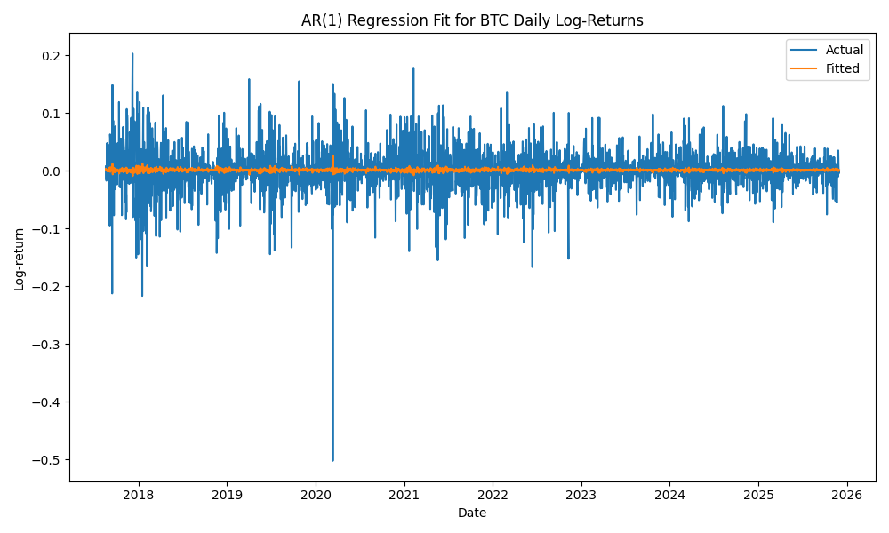

# Лінійна регресія AR(1) для щоденних логарифмічних доходностей BTC/USDT

## 1. Модель

Для перевірки наявності лінійної автокореляції було побудовано AR(1)-регресію:

$$
r_t = a + b\, r_{t-1} + \varepsilon_t
$$

де  
- **rₜ** — поточна денна логарифмічна доходність BTC/USDT,  
- **rₜ₋₁** — її значення на попередній день,  
- **εₜ** — випадкова помилка.

---

## 2. Оцінені параметри

| Параметр | Оцінка | P-value |
|----------|---------|--------|
| const | 0.0011 | 0.103 |
| lag1 (rₜ₋₁) | –0.0508 | 0.005 |

### Інтерпретація:

- **b ≈ –0.05**: слабкий, але статистично значущий *mean reversion*  
  (негативна автокореляція → після зростання трохи частіше йде падіння).
- Константа **не значуща**, середнє значення доходностей ≈ 0.
- R² = **0.003** → модель пояснює лише **0.3% варіації** доходностей.

Це типовий результат для фінансових ринків:  
**щоденні доходності майже непередбачувані і не мають сильної лінійної структури.**

---

## 3. Якість моделі

- **Durbin–Watson ≈ 1.995** — залишки ≈ незалежні.
- **Omnibus / Jarque–Bera: p ≈ 0** — залишки *далекі від нормальності*.
- **Куртозис ≈ 18.6** — «товсті хвости».
- **Асиметрія ≈ –1** — переважання різких падінь над зростаннями.

Модель не здатна відтворити розподіл помилок — що очікувано для крипторинку.

---

## 4. Графік моделі

Нижче наведено графік фактичних та модельних значень:

Висновки з графіка:
- фактичні доходності (синя лінія) дуже волатильні,
- модель (помаранчева лінія) фактично **плоска** і не відтворює поведінку ринку,
- AR(1) не ловить високочастотну структуру returns.

---

## 5. Висновок

1. AR(1)-регресія показує дуже слабку автокореляцію (b ≈ –0.05).  
2. Значення R² ≈ 0 → модель **практично нічого не пояснює**.  
3. Лінійна модель не здатна відтворити волатильність та структуру лог-доходностей BTC.  
4. AR(1) не підходить для прогнозування криптовалют, але є корисною як базовий бенчмарк.  
5. Значно кращі результати дає ARIMA, оскільки враховує MA-структури та складнішу часову динаміку.

Таким чином, AR(1) є слабкою, референсною моделлю і поступається ARIMA як за якістю підгонки, так і за можливостями прогнозування.
